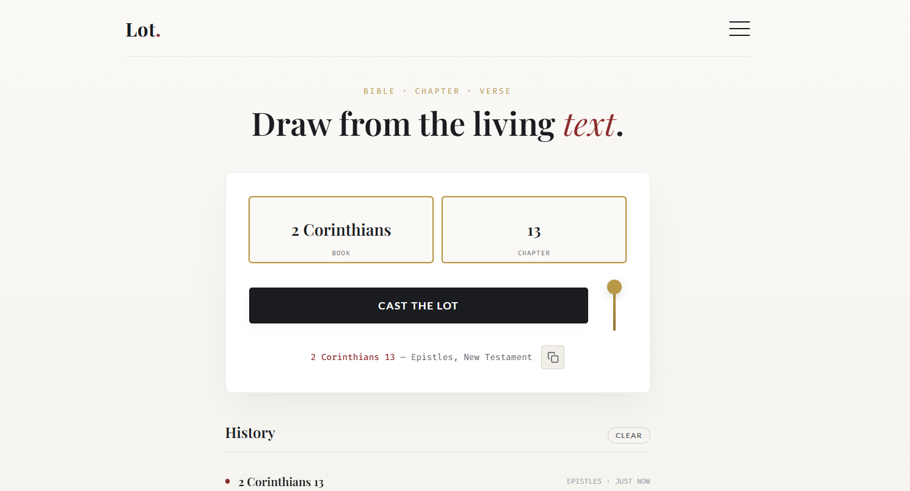

<div align="center">
  <br />
  <a href="https://bible-lot.vercel.app/">
    
  </a>
  <br /><br />
  <h1>Lot &mdash; A Sacred Scripture Draw</h1>
  <p>
    <strong>"The lot is cast into the lap, but its every decision is from the Lord." — Proverbs 16:33</strong><br/><br/>
    An ultra-minimalist, mathematically verified instrument for drawing random Bible verses. <br/>
    No curated algorithms. No digital noise. Just the raw, ancient text.
  </p>
  <p>
    <a href="https://bible-lot.vercel.app/">Generate a random chapter (Live Demo)</a>
    ·
    <a href="https://github.com/your-username/lot/issues">Report Bug</a>
    ·
    <a href="https://github.com/your-username/lot/issues">Request Feature</a>
  </p>

  
  
  
  
</div>

---

## 📖 The Story: Why I Built This

My days are spent building heavy, logic-driven web applications. I architect databases, configure serverless environments, and write backend code to parse endless streams of data. But late one night, bathed in the harsh glow of my EliteBook, the digital world felt incredibly shallow. I was experiencing profound tech fatigue. I just wanted a moment of quiet. I wanted to hear from God. 

When I was growing up, I heard it all the time from pastors and mentors: *"If you want to grow spiritually, you need to read your Bible."* 

I agreed. But I always struggled.

The reason was simple: too many options. There are 66 books in the Bible. Which one do I start with? Which chapter? Which verse? There’s a concept in psychology called the paradox of choice—when you have too many options, it becomes harder to make any decision at all. That was me. Instead of reading, I’d just get stuck.

Over time, I figured out how to navigate the Word for myself, but along the way, I realized I’m not the only one. There are so many young Christians out there who genuinely want to read their Bible. They want to meditate on it. But the sheer volume leaves them paralyzed. They just don't know where to start.

Throughout scripture, when early believers and ancient priests reached the limits of their own understanding, they didn't rely on logic—they cast lots. It wasn't a gamble; it was an act of total surrender. It was a physical way of stepping aside and saying, *"I don't know, but Providence does."*

That is why I created **Lot**.

I believe every single word in the Bible is important. Every verse, every chapter. When you get the right interpretation, it comes alive and makes sense for your exact season. *Lot* takes away the confusion. It removes the paralyzing question of *"Where do I start?"* and replaces it with a simple, quiet digital sanctuary.

It simply gives you a random verse, chapter, or book to go and chew on. To meditate on. To grow from. No curated feeds, no algorithms. Just cast the lot, and let God’s Word meet you right where you are.

## ✨ Features

- **Sacred Boundaries:** The core engine hardcodes the exact chapter and verse limits for all 66 books of the Bible. It is physically impossible to draw a reference that does not exist.
- **Physical Mechanics:** The "Cast the lot" lever mimics real-world string tension—dropping rapidly with a bounce, and rising slowly to simulate mechanical loading and anticipation.
- **Granular Providence:** Filter your draw by Testament, Genre (Law, History, Wisdom, Prophets, Gospels, Acts, Epistles, Prophecy), or manually select specific books to draw from.
- **Smart Ledger Caching:** Remembers your last 30 draws and intelligently avoids repeating them until the pool runs low. All history and filter preferences are saved locally and privately in `localStorage`.
- **One-Click Scribing:** Seamlessly copy the drawn reference and verse text to your clipboard for journaling, complete with a clean, minimalist UI tick animation.
- **Zero Dependencies:** Built entirely in pure HTML, CSS, and vanilla JavaScript. Light, fast, and timeless.

## 🚀 Quick Start / Hosting

**Lot** is incredibly lightweight. Because it uses zero build tools (no React, no Webpack, no `node_modules`), it is arguably the easiest project in the world to host.

1. **Fork or Clone this repository.**
2. Drop the `index.html`, `screenshot.jpg`, and your `README.md` into any static hosting service.
3. Done.

**Recommended Free Hosts:**
* [Vercel](https://vercel.com/) (Currently hosted at [bible-lot.vercel.app](https://bible-lot.vercel.app/))
* [Netlify](https://www.netlify.com/)
* [GitHub Pages](https://pages.github.com/)

## 🛠 Under the Hood

### The Codex Array
The engine runs on a highly compressed nested array containing all biblical metadata to keep the app blazing fast without needing a database.
```javascript
// Structure: [Book Name, Testament, Genre, [Array of Verse Counts per Chapter]]
["Genesis", "OT", "Law", [31, 25, 24, 26, ...]]
